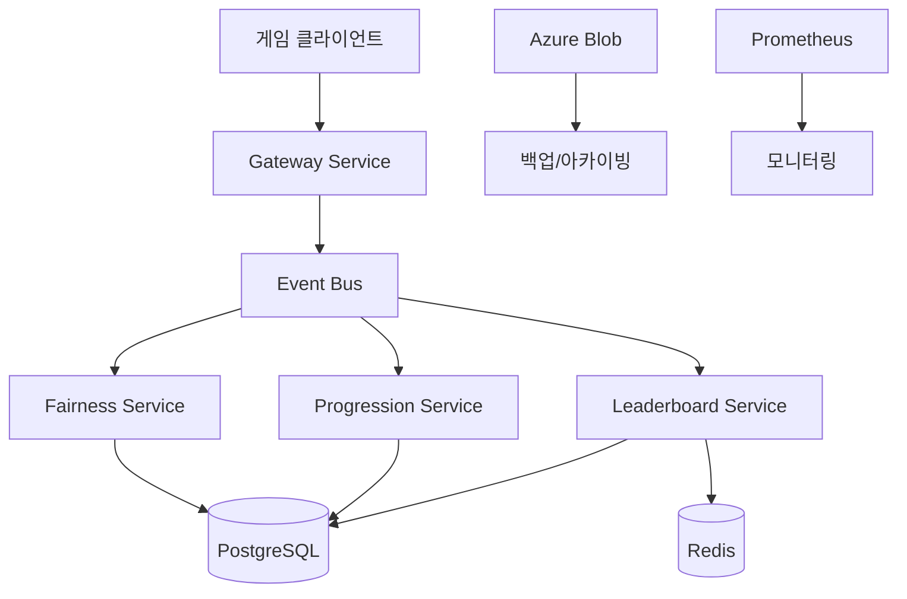

# 🚀 Go-Microservices 인프라 및 DevOps 전략 가이드

## 📋 프로젝트 개요 및 시나리오

### 🎯 비즈니스 시나리오
이 프로젝트는 **실시간 게임 LiveOps 플랫폼**을 구축하기 위한 마이크로서비스 아키텍처입니다.

**핵심 비즈니스 요구사항**:
- 📈 **대규모 게임 이벤트 처리**: 동시 접속자 수천~수만 명의 게임플레이 이벤트 실시간 수집
- 🏆 **실시간 리더보드**: 일일/주간/시즌별 순위 시스템
- ⚖️ **공정성 검증**: 게임 내 치팅 및 이상 행동 탐지
- 🎮 **진행도 추적**: 플레이어별 경험치, 레벨, 보상 관리
- 🔒 **보안 강화**: HMAC 서명 검증, 중복 요청 방지, 속도 제한

### 🏗️ 아키텍처 설계 철학


---

## 🛠️ 기술 스택 및 구성요소

### 🎯 Core Technologies
| 구성요소 | 기술스택 | 역할 | 포트 |
|---------|---------|------|------|
| **Gateway** | Go 1.22 + Chi | 이벤트 수집 API | 8080 |
| **Fairness** | Go 1.22 + Chi | 공정성 검증 | 8081 |
| **Leaderboard** | Go 1.22 + Chi | 순위 시스템 | 8082 |
| **Progression** | Go 1.22 + Chi | 진행도 추적 | 8083 |
| **Web Dashboard** | HTML/JS | 관리자 대시보드 | 3000 |

### 🗄️ 데이터 저장소
```yaml
Primary Database:
  - PostgreSQL (Azure Database for PostgreSQL)
  - 역할: 영구 저장, 이벤트 로그, 백업 데이터
  
Cache Layer:
  - Redis (Azure Cache for Redis)
  - 역할: 실시간 리더보드, 세션 캐시, 속도 제한
  
Cloud Storage:
  - Azure Blob Storage
  - 역할: 로그 아카이빙, 백업, 정적 자산
```

### 🚌 메시지 시스템
```yaml
Event Bus Options:
  - InMemory: 개발/테스트 환경
  - Azure Service Bus: 프로덕션 환경
  - AWS SQS: 하이브리드 클라우드 지원
```

---

## 🏭 개발 워크플로우 및 환경 구성

### 🌱 개발 환경 설정

#### 1단계: 로컬 개발 환경
```bash
# 필수 도구 설치
go version  # Go 1.22+ 필요
docker --version
make --version

# 프로젝트 클론 및 의존성 설치
git clone https://github.com/tkdals69/go-microservices.git
cd go-microservices
go mod download

# 로컬 인프라 시작 (Docker Compose)
docker-compose up -d postgres redis

# 환경 변수 설정
cp .env.example .env
# .env 파일 편집하여 로컬 설정 적용

# 빌드 및 테스트
make build
make test
```

#### 2단계: 서비스 개별 실행
```bash
# 터미널 1: Gateway
make run-gateway

# 터미널 2: Fairness
make run-fairness

# 터미널 3: Progression  
make run-progression

# 터미널 4: Leaderboard
make run-leaderboard

# 터미널 5: Web Dashboard
cd web && go run main.go
```

### 🔄 Git 워크플로우
```yaml
브랜치 전략: GitHub Flow
  - main: 프로덕션 배포 가능한 안정 브랜치
  - feature/*: 기능 개발 브랜치
  - hotfix/*: 긴급 수정 브랜치

PR 규칙:
  - 최소 1명 리뷰 필수
  - 모든 테스트 통과 필수
  - 보안 스캔 통과 필수
```

---

## 🚀 배포 전략 및 인프라 구성

### 🎯 환경별 배포 전략

#### Development Environment
```yaml
배포 방식: Docker Compose
인프라: 로컬 개발 머신
목적: 개발자 개별 테스트
자동화: GitHub Actions (dev 브랜치 push시)

서비스 구성:
  - 모든 서비스 단일 호스트
  - 로컬 PostgreSQL/Redis
  - 파일 기반 로깅
```

#### Staging Environment
```yaml
배포 방식: Azure Container Instances
인프라: Azure 리소스 그룹 (staging)
목적: 통합 테스트, QA 검증
자동화: GitHub Actions (staging 브랜치 merge시)

서비스 구성:
  - Azure DB for PostgreSQL (Basic 티어)
  - Azure Cache for Redis (Basic 티어) 
  - Azure Blob Storage (Standard 티어)
  - Application Insights (모니터링)
```

#### Production Environment  
```yaml
배포 방식: Azure Kubernetes Service (AKS)
인프라: Azure 리소스 그룹 (production)
목적: 실제 서비스 운영
자동화: GitHub Actions (main 브랜치 tag push시)

서비스 구성:
  - Azure DB for PostgreSQL (General Purpose 티어)
  - Azure Cache for Redis (Premium 티어)
  - Azure Blob Storage (Premium 티어)
  - Azure Service Bus (Standard 티어)
  - Application Insights + Log Analytics
```

### 🏗️ Azure 리소스 구성

#### Infrastructure as Code (Terraform)
```hcl
# terraform/main.tf
resource "azurerm_resource_group" "main" {
  name     = "rg-liveops-${var.environment}"
  location = "Korea Central"
}

resource "azurerm_kubernetes_cluster" "main" {
  name                = "aks-liveops-${var.environment}"
  resource_group_name = azurerm_resource_group.main.name
  location            = azurerm_resource_group.main.location
  dns_prefix          = "liveops-${var.environment}"

  default_node_pool {
    name       = "default"
    node_count = var.node_count
    vm_size    = "Standard_D2s_v3"
  }

  identity {
    type = "SystemAssigned"
  }
}

resource "azurerm_postgresql_flexible_server" "main" {
  name                = "psql-liveops-${var.environment}"
  resource_group_name = azurerm_resource_group.main.name
  location            = azurerm_resource_group.main.location
  version             = "14"
  
  administrator_login    = var.db_admin_username
  administrator_password = var.db_admin_password
  
  sku_name = var.environment == "production" ? "GP_Standard_D2s_v3" : "B_Standard_B1ms"
}
```

#### Kubernetes Manifests
```yaml
# k8s/gateway-deployment.yaml
apiVersion: apps/v1
kind: Deployment
metadata:
  name: gateway
  namespace: liveops
spec:
  replicas: 3
  selector:
    matchLabels:
      app: gateway
  template:
    metadata:
      labels:
        app: gateway
    spec:
      containers:
      - name: gateway
        image: liveops.azurecr.io/gateway:${IMAGE_TAG}
        ports:
        - containerPort: 8080
        env:
        - name: ENV
          value: "production"
        - name: DB_URL
          valueFrom:
            secretKeyRef:
              name: db-secret
              key: connection-string
        resources:
          requests:
            memory: "128Mi"
            cpu: "100m"
          limits:
            memory: "256Mi" 
            cpu: "200m"
---
apiVersion: v1
kind: Service
metadata:
  name: gateway-service
  namespace: liveops
spec:
  selector:
    app: gateway
  ports:
  - port: 80
    targetPort: 8080
  type: LoadBalancer
```

---

## 🤖 자동화 파이프라인

### 🔄 CI/CD 파이프라인 (GitHub Actions)

#### 1. Build & Test Pipeline
```yaml
# .github/workflows/build-test.yml
name: Build and Test
on:
  pull_request:
    branches: [main, staging]
  push:
    branches: [main, staging, dev]

jobs:
  test:
    runs-on: ubuntu-latest
    steps:
    - uses: actions/checkout@v4
    - uses: actions/setup-go@v4
      with:
        go-version: '1.22'
    
    - name: Cache Go modules
      uses: actions/cache@v3
      with:
        path: ~/go/pkg/mod
        key: ${{ runner.os }}-go-${{ hashFiles('**/go.sum') }}
    
    - name: Install dependencies
      run: go mod download
      
    - name: Run tests
      run: |
        go test -v -race -coverprofile=coverage.out ./...
        go tool cover -html=coverage.out -o coverage.html
        
    - name: Upload coverage reports
      uses: codecov/codecov-action@v3
      
    - name: Security scan
      uses: securecodewarrior/github-action-add-sarif@v1
      with:
        sarif-file: gosec-report.sarif

  build:
    needs: test
    runs-on: ubuntu-latest
    steps:
    - uses: actions/checkout@v4
    
    - name: Set up Docker Buildx
      uses: docker/setup-buildx-action@v2
      
    - name: Login to Azure Container Registry
      uses: azure/docker-login@v1
      with:
        login-server: liveops.azurecr.io
        username: ${{ secrets.ACR_USERNAME }}
        password: ${{ secrets.ACR_PASSWORD }}
        
    - name: Build and push images
      run: |
        docker buildx build -f Dockerfile.gateway -t liveops.azurecr.io/gateway:${{ github.sha }} --push .
        docker buildx build -f Dockerfile.fairness -t liveops.azurecr.io/fairness:${{ github.sha }} --push .
        docker buildx build -f Dockerfile.progression -t liveops.azurecr.io/progression:${{ github.sha }} --push .
        docker buildx build -f Dockerfile.leaderboard -t liveops.azurecr.io/leaderboard:${{ github.sha }} --push .
```

#### 2. Deployment Pipeline
```yaml
# .github/workflows/deploy.yml
name: Deploy to Azure
on:
  push:
    tags:
      - 'v*'

jobs:
  deploy-staging:
    if: contains(github.ref, 'rc')
    runs-on: ubuntu-latest
    environment: staging
    steps:
    - name: Deploy to AKS Staging
      uses: azure/k8s-deploy@v1
      with:
        manifests: |
          k8s/namespace.yaml
          k8s/secrets.yaml
          k8s/gateway-deployment.yaml
          k8s/fairness-deployment.yaml
          k8s/progression-deployment.yaml
          k8s/leaderboard-deployment.yaml
        images: |
          liveops.azurecr.io/gateway:${{ github.sha }}
          liveops.azurecr.io/fairness:${{ github.sha }}
          liveops.azurecr.io/progression:${{ github.sha }}
          liveops.azurecr.io/leaderboard:${{ github.sha }}
        kubectl-version: 'latest'

  deploy-production:
    if: "!contains(github.ref, 'rc')"
    runs-on: ubuntu-latest
    environment: production
    needs: [deploy-staging]
    steps:
    - name: Blue-Green Deployment
      uses: azure/k8s-deploy@v1
      with:
        strategy: blue-green
        traffic-split-method: pod
        baseline-and-canary-replicas: 1
        percentage: 20
```

### 📊 자동화된 품질 게이트
```yaml
Quality Gates:
  - 코드 커버리지 > 80%
  - 보안 취약점 0개 (Critical/High)
  - 성능 테스트 통과 (응답시간 < 200ms)
  - 로드 테스트 통과 (1000 RPS 처리)
  - 의존성 보안 스캔 통과
```

---

## 📊 모니터링 및 관찰성 (Observability)

### 🔍 모니터링 스택

#### 1. 메트릭 수집 (Prometheus + Grafana)
```yaml
# 핵심 메트릭
Business Metrics:
  - events_processed_total: 처리된 이벤트 총 개수
  - active_players_gauge: 현재 활성 플레이어 수
  - leaderboard_updates_total: 리더보드 업데이트 횟수
  - cheating_events_detected: 치팅 감지 이벤트 수

Technical Metrics:
  - http_requests_duration_seconds: HTTP 응답 시간
  - http_requests_total: HTTP 요청 총 개수  
  - database_connections_active: 활성 DB 연결 수
  - redis_operations_total: Redis 작업 총 개수
  - memory_usage_bytes: 메모리 사용량
  - cpu_usage_percent: CPU 사용률
```

#### 2. 로그 관리 (Azure Log Analytics)
```json
{
  "timestamp": "2024-09-04T10:30:00Z",
  "level": "INFO",
  "service": "gateway",
  "trace_id": "abc123def456",
  "player_id": "player_12345",
  "event_type": "progression",
  "message": "Event processed successfully",
  "duration_ms": 45,
  "metadata": {
    "request_id": "req_789",
    "user_agent": "GameClient/1.0"
  }
}
```

#### 3. 분산 추적 (Azure Application Insights)
```go
// 예시: 분산 추적 구현
func (h *GatewayHandler) PostEvent(w http.ResponseWriter, r *http.Request) {
    ctx, span := trace.StartSpan(r.Context(), "gateway.post_event")
    defer span.End()
    
    // 이벤트 처리 로직
    event, err := h.parseEvent(ctx, r)
    if err != nil {
        span.SetStatus(trace.Status{Code: trace.StatusCodeInvalidArgument})
        return
    }
    
    // 다운스트림 서비스 호출
    err = h.messageBus.Publish(ctx, event)
    if err != nil {
        span.SetStatus(trace.Status{Code: trace.StatusCodeInternal})
        return
    }
    
    span.AddAttributes(
        trace.StringAttribute("player_id", event.PlayerID),
        trace.StringAttribute("event_type", event.Type),
    )
}
```

### 🚨 알림 및 경고

#### Alerting Rules (Prometheus)
```yaml
# alerts/rules.yml  
groups:
- name: liveops_alerts
  rules:
  - alert: HighErrorRate
    expr: rate(http_requests_total{status=~"5.."}[5m]) > 0.1
    for: 2m
    labels:
      severity: critical
    annotations:
      summary: "High error rate detected"
      description: "Error rate is {{ $value }} for service {{ $labels.service }}"

  - alert: DatabaseConnectionsHigh  
    expr: database_connections_active > 80
    for: 5m
    labels:
      severity: warning
    annotations:
      summary: "Database connection pool nearly exhausted"

  - alert: CheatDetectionSpike
    expr: increase(cheating_events_detected[10m]) > 50
    for: 1m
    labels:
      severity: critical
    annotations:
      summary: "Unusual spike in cheating detection"
```

#### 알림 채널
```yaml
Notification Channels:
  - Slack: #liveops-alerts (실시간 알림)
  - Email: devops@company.com (Critical만)
  - PagerDuty: 야간/주말 긴급상황
  - Teams: #game-ops (비즈니스 팀)
```

---

## 🔒 보안 및 컴플라이언스

### 🛡️ 보안 계층

#### 1. 네트워크 보안
```yaml
Network Security:
  - Azure Network Security Groups
  - Private Endpoints for 데이터베이스
  - TLS 1.3 for all communications
  - Azure Web Application Firewall

API Security:
  - HMAC Signature Verification
  - Rate Limiting (50 req/min per IP)
  - Idempotency Keys (중복 요청 방지)
  - Input Validation & Sanitization
```

#### 2. 인증/인가
```go
// middleware/auth.go
func HMACMiddleware(secret string) func(http.Handler) http.Handler {
    return func(next http.Handler) http.Handler {
        return http.HandlerFunc(func(w http.ResponseWriter, r *http.Request) {
            signature := r.Header.Get("X-Signature")
            if signature == "" {
                http.Error(w, "Missing signature", http.StatusUnauthorized)
                return
            }
            
            body, _ := io.ReadAll(r.Body)
            r.Body = io.NopCloser(bytes.NewReader(body))
            
            expectedSig := core.GenerateHMAC(body, secret)
            if !hmac.Equal([]byte(signature), []byte(expectedSig)) {
                http.Error(w, "Invalid signature", http.StatusUnauthorized)
                return
            }
            
            next.ServeHTTP(w, r)
        })
    }
}
```

#### 3. 데이터 보호
```yaml
Data Protection:
  - Encryption at Rest (Azure Storage Service Encryption)
  - Encryption in Transit (TLS 1.3)
  - Database Encryption (Transparent Data Encryption)
  - Secrets Management (Azure Key Vault)
  
Data Retention:
  - Event Logs: 2년 보관 후 아카이빙
  - Personal Data: GDPR 준수 (삭제 요청 처리)
  - Audit Logs: 7년 보관 (규정 준수)
```

### 🔍 보안 스캔 자동화
```yaml
# .github/workflows/security.yml
Security Scans:
  - SAST: CodeQL, SonarQube
  - DAST: OWASP ZAP
  - Container Scan: Trivy, Snyk
  - Dependency Check: GitHub Dependabot
  - Infrastructure Scan: Checkov
```

---

## 📈 성능 최적화 및 확장성

### ⚡ 성능 최적화 전략

#### 1. 캐싱 전략
```go
// Redis 캐싱 패턴
type CacheManager struct {
    client *redis.Client
}

// 리더보드 캐싱 (ZSET 활용)
func (c *CacheManager) UpdateLeaderboard(season, window string, playerID string, score int64) error {
    key := fmt.Sprintf("lb:%s:%s", season, window)
    return c.client.ZAdd(context.Background(), key, &redis.Z{
        Score:  float64(score),
        Member: playerID,
    }).Err()
}

// 읽기 전용 복제본 활용
func (c *CacheManager) GetTopPlayers(season, window string, limit int) ([]PlayerScore, error) {
    key := fmt.Sprintf("lb:%s:%s", season, window)
    results, err := c.client.ZRevRangeWithScores(context.Background(), key, 0, int64(limit-1)).Result()
    if err != nil {
        return nil, err
    }
    
    // 결과 변환 로직
    return convertToPlayerScores(results), nil
}
```

#### 2. 데이터베이스 최적화
```sql
-- 인덱스 전략
CREATE INDEX CONCURRENTLY idx_events_player_ts ON events(player_id, timestamp DESC);
CREATE INDEX CONCURRENTLY idx_events_type_ts ON events(event_type, timestamp DESC);
CREATE INDEX CONCURRENTLY idx_leaderboard_season_window ON leaderboards(season, window, score DESC);

-- 파티셔닝 전략 (월별)
CREATE TABLE events_2024_09 PARTITION OF events 
FOR VALUES FROM ('2024-09-01') TO ('2024-10-01');
```

#### 3. 수평 확장 설계
```yaml
Auto-scaling Rules:
  HPA (Horizontal Pod Autoscaler):
    - CPU > 70% 시 스케일 아웃
    - Memory > 80% 시 스케일 아웃
    - Custom Metric: events/sec > 1000시 스케일 아웃
    
  VPA (Vertical Pod Autoscaler):
    - 메모리 사용 패턴 기반 리소스 조정
    
Database Scaling:
  - Read Replicas: 읽기 전용 쿼리 분산
  - Connection Pooling: pgbouncer 활용
  - Query Optimization: 슬로우 쿼리 모니터링
```

---

## 📋 운영 계획 및 SLA

### 🎯 서비스 수준 목표 (SLO)

#### 가용성 목표
```yaml
Service Availability:
  - Gateway: 99.9% (월 43분 다운타임 허용)
  - Fairness: 99.5% (월 216분 다운타임 허용)
  - Progression: 99.9% (월 43분 다운타임 허용)
  - Leaderboard: 99.99% (월 4.3분 다운타임 허용)

Performance Targets:
  - API 응답 시간: P95 < 200ms, P99 < 500ms
  - 이벤트 처리 지연: < 1초
  - 리더보드 업데이트: < 5초
  - 데이터베이스 쿼리: P95 < 100ms
```

### 🚨 장애 대응 계획

#### 1. 장애 분류 및 대응
```yaml
P0 (Critical): 전체 서비스 중단
  - 대응시간: 15분 이내 
  - 복구목표: 1시간 이내
  - 에스컬레이션: 즉시 CTO 호출
  
P1 (High): 핵심 기능 장애  
  - 대응시간: 30분 이내
  - 복구목표: 4시간 이내
  - 에스컬레이션: 팀리드 및 DevOps 팀
  
P2 (Medium): 부분 기능 장애
  - 대응시간: 2시간 이내  
  - 복구목표: 8시간 이내
  - 에스컬레이션: 담당 개발자
```

#### 2. 백업 및 재해 복구
```yaml
Backup Strategy:
  Database:
    - 자동 백업: 매일 자정 (7일 보관)
    - 포인트인타임 복구: 35일
    - 지역간 복제: Korea South (재해 복구용)
  
  Redis:
    - RDB 스냅샷: 6시간마다
    - AOF 복제: 실시간
    
Disaster Recovery:
  - RTO (Recovery Time Objective): 4시간
  - RPO (Recovery Point Objective): 15분  
  - DR 테스트: 분기별 수행
```

---

## 🚀 프로젝트 로드맵 및 향후 개선사항

### Phase 1: MVP 완료 ✅ (현재)
```yaml
완료된 기능:
  - ✅ 4개 마이크로서비스 구현 및 테스트
  - ✅ HMAC 인증, Rate Limiting, Idempotency
  - ✅ Docker 컨테이너화
  - ✅ 기본 모니터링 및 헬스체크
  - ✅ 단위/통합 테스트 코드
  - ✅ API 문서화 (OpenAPI)
```

### Phase 2: 프로덕션 준비 (2주)
```yaml
Infrastructure:
  - [ ] Terraform 인프라 코드 작성
  - [ ] Azure 리소스 프로비저닝
  - [ ] CI/CD 파이프라인 구축
  - [ ] 보안 스캔 자동화
  
Operations:
  - [ ] 로그 수집 및 분석 시스템
  - [ ] 알림 및 대시보드 구축  
  - [ ] 백업/복구 절차 문서화
  - [ ] 성능 테스트 및 튜닝
```

### Phase 3: 고급 기능 (1개월)
```yaml
Advanced Features:
  - [ ] 실시간 사기 탐지 ML 모델
  - [ ] 게임 밸런싱 자동화
  - [ ] A/B 테스트 프레임워크
  - [ ] 플레이어 세그멘테이션
  
Scalability:  
  - [ ] 메시지 큐 샤딩
  - [ ] 데이터베이스 샤딩
  - [ ] CDN 통합 (정적 자산)
  - [ ] 멀티 리전 배포
```

### Phase 4: 인공지능 및 분석 (2개월)
```yaml
AI/ML Integration:
  - [ ] 플레이어 행동 예측 모델
  - [ ] 실시간 치팅 탐지 AI
  - [ ] 개인화 추천 엔진
  - [ ] 자동 이벤트 최적화
  
Advanced Analytics:
  - [ ] 실시간 데이터 스트리밍 (Kafka)
  - [ ] 데이터 레이크 구축 (Azure Data Lake)
  - [ ] BI 대시보드 (Power BI)
  - [ ] 예측 분석 및 알림
```

---

## 📚 운영 매뉴얼 및 문서

### 👥 팀 역할 및 책임
```yaml
Development Team:
  - Backend Engineers: 서비스 로직 개발, API 설계
  - DevOps Engineers: 인프라, CI/CD, 모니터링
  - QA Engineers: 테스트 자동화, 품질 보증
  
Operations Team:  
  - Site Reliability Engineers: 운영, 장애 대응
  - Security Engineers: 보안 감사, 컴플라이언스
  - Data Engineers: 데이터 파이프라인, 분석
```

### 📖 문서 체계
```
docs/
├── architecture/
│   ├── system-design.md
│   ├── api-specifications.md  
│   └── data-flow-diagrams.md
├── operations/
│   ├── deployment-guide.md
│   ├── monitoring-playbook.md
│   └── incident-response.md
├── development/
│   ├── coding-standards.md
│   ├── testing-guidelines.md
│   └── contribution-guide.md
└── security/
    ├── security-policies.md
    ├── audit-procedures.md
    └── compliance-checklist.md
```

---

## 💰 비용 최적화 전략

### 💸 Azure 리소스 비용 예측
```yaml
Development Environment (월 예상 비용):
  - ACI (Container Instances): $50
  - PostgreSQL (Basic): $25
  - Redis (Basic): $15
  - Storage: $10
  - 총계: ~$100/월

Staging Environment:
  - AKS (2 nodes): $150
  - PostgreSQL (General Purpose): $80
  - Redis (Standard): $40  
  - Storage + Traffic: $30
  - 총계: ~$300/월
  
Production Environment:
  - AKS (5 nodes + auto-scaling): $500
  - PostgreSQL (High Performance): $200
  - Redis (Premium): $120
  - Service Bus: $50
  - Storage + CDN: $80
  - Monitoring: $30
  - 총계: ~$980/월
```

### 📊 비용 최적화 방안
```yaml
Cost Optimization:
  - Reserved Instances: 1년 예약시 40% 절약
  - Spot Instances: 개발 환경에서 80% 절약
  - Auto-scaling: 비피크 시간 리소스 축소
  - Storage Tiering: 오래된 데이터 Cold storage
  - Resource Right-sizing: 정기적 사용량 분석
```

---

이 문서는 Go-Microservices 프로젝트의 **전체적인 인프라 전략과 DevOps 계획**을 담고 있습니다. 게임 LiveOps 플랫폼이라는 명확한 비즈니스 시나리오 하에서 **확장 가능하고 안정적인 마이크로서비스 아키텍처**를 구축하기 위한 종합적인 가이드입니다.

**핵심 특징**:
- 🎯 **비즈니스 중심**: 실시간 게임 데이터 처리에 최적화
- 🏗️ **클라우드 네이티브**: Azure 생태계 완전 활용  
- 🤖 **완전 자동화**: CI/CD부터 모니터링까지
- 🔒 **보안 우선**: 다층 보안 및 컴플라이언스
- 📈 **확장성**: 수천 동시 사용자 대응 가능

이제 이 계획을 기반으로 단계적으로 인프라를 구축하고 운영할 수 있습니다! 🚀
