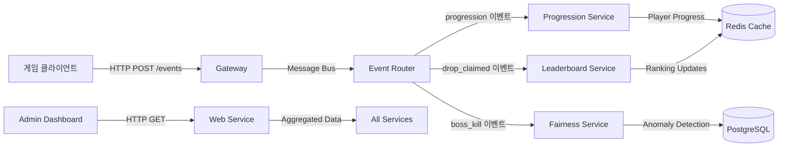
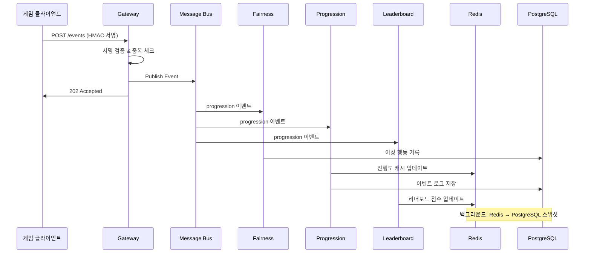

# 🔧 기술 구현 상세 가이드 (Technical Implementation Guide)

## 📋 목차
1. [코드 아키텍처 분석](#코드-아키텍처-분석)
2. [핵심 구성 요소](#핵심-구성-요소)
3. [데이터 플로우](#데이터-플로우)
4. [API 설계 패턴](#api-설계-패턴)
5. [성능 최적화](#성능-최적화)
6. [보안 구현](#보안-구현)
7. [테스트 전략](#테스트-전략)
8. [배포 자동화](#배포-자동화)

---

## 🏗️ 코드 아키텍처 분석

### 📁 프로젝트 구조 상세
```
go-microservices/
├── 🚪 cmd/                    # 서비스 엔트리포인트
│   ├── gateway/main.go         # API Gateway (포트: 8080)
│   ├── fairness/main.go        # 공정성 검증 (포트: 8081) 
│   ├── progression/main.go     # 진행도 추적 (포트: 8083)
│   └── leaderboard/main.go     # 리더보드 (포트: 8082)
├── 📦 pkg/                    # 공유 라이브러리
│   ├── 🔌 adapters/           # 외부 시스템 연동
│   │   ├── bus_inmem.go        # 메모리 메시지 버스
│   │   ├── bus_aws_sqs.go      # AWS SQS 어댑터  
│   │   ├── bus_azure_servicebus.go # Azure Service Bus
│   │   ├── cache/redis.go      # Redis 캐시 어댑터
│   │   ├── db/postgres.go      # PostgreSQL 어댑터
│   │   └── cloud/azure.go      # Azure Blob 스토리지
│   ├── ⚙️ config/             # 설정 관리
│   │   └── config.go           # 환경변수 로딩
│   ├── 🎯 core/               # 핵심 비즈니스 로직
│   │   ├── models.go           # 데이터 모델 정의
│   │   ├── validation.go       # 입력 검증
│   │   ├── hmac.go            # HMAC 서명/검증
│   │   └── receipts.go         # 보상 영수증 시스템
│   ├── 🌐 handlers/           # HTTP 핸들러
│   │   ├── gateway.go          # 이벤트 수집 API
│   │   ├── fairness.go         # 공정성 검증 API
│   │   ├── progression.go      # 진행도 추적 API
│   │   └── leaderboard.go      # 리더보드 API
│   ├── 🛡️ middleware/         # HTTP 미들웨어
│   │   ├── hmac.go            # HMAC 인증
│   │   ├── idempotency.go      # 중복 요청 방지
│   │   └── ratelimit.go        # 속도 제한
│   ├── 📊 observability/      # 관찰성 (모니터링)
│   │   ├── healthz.go          # 헬스체크
│   │   ├── logger.go           # 구조화된 로깅
│   │   └── metrics.go          # Prometheus 메트릭
│   └── 🧪 tests/              # 테스트 코드
│       ├── unit/sample_test.go # 단위 테스트
│       └── integration/http_integration_test.go # 통합 테스트
├── 🌍 web/                    # 웹 대시보드
│   ├── main.go                 # 웹 서버 (포트: )
│   ├── static/                 # 정적 자산
│   └── templates/              # HTML 템플릿
├── 🎮 sample_events/          # 샘플 이벤트 데이터
├── 📜 api/openapi.yaml        # API 명세
├── 🐳 Dockerfile.*           # 컨테이너 이미지
├── 📋 Makefile               # 빌드 스크립트
└── 📄 .env.example           # 환경 변수 템플릿
```

### 🔄 서비스 간 통신 패턴


---

## 🎯 핵심 구성 요소

### 1️⃣ Gateway Service (이벤트 수집)
```go
// pkg/handlers/gateway.go
type GatewayHandler struct {
    bus        MessageBus          // 메시지 버스 인터페이스
    validator  *core.Validator     // 이벤트 검증기
    logger     *observability.Logger // 구조화된 로거
}

func (h *GatewayHandler) PostEvent(w http.ResponseWriter, r *http.Request) {
    // 1. 요청 파싱 및 검증
    var event core.Event
    if err := json.NewDecoder(r.Body).Decode(&event); err != nil {
        h.logger.Error("Invalid event payload", map[string]interface{}{
            "error": err.Error(),
            "client_ip": r.RemoteAddr,
        })
        http.Error(w, "Invalid event format", http.StatusBadRequest)
        return
    }
    
    // 2. 비즈니스 로직 검증
    if err := h.validator.ValidateEvent(&event); err != nil {
        h.logger.Error("Event validation failed", map[string]interface{}{
            "event_type": event.Type,
            "player_id": event.PlayerID,
            "error": err.Error(),
        })
        http.Error(w, err.Error(), http.StatusBadRequest)
        return
    }
    
    // 3. 메시지 버스로 이벤트 발행
    if err := h.bus.Publish(r.Context(), event.Type, &event); err != nil {
        h.logger.Error("Failed to publish event", map[string]interface{}{
            "event_type": event.Type,
            "player_id": event.PlayerID,
            "error": err.Error(),
        })
        http.Error(w, "Internal server error", http.StatusInternalServerError)
        return
    }
    
    // 4. 성공 응답
    h.logger.Info("Event processed successfully", map[string]interface{}{
        "event_type": event.Type,
        "player_id": event.PlayerID,
        "timestamp": event.Ts,
    })
    
    w.WriteHeader(http.StatusAccepted)
    w.Write([]byte("Event accepted"))
}
```

### 2️⃣ Fairness Service (공정성 검증)
```go
// pkg/handlers/fairness.go
type FairnessHandler struct {
    db          Database            // 데이터베이스 인터페이스
    detector    *AnomalyDetector    // 이상 탐지 엔진
    cache       Cache               // Redis 캐시
    threshold   float64             // 이상 탐지 임계값
}

func (h *FairnessHandler) ProcessEvent(ctx context.Context, event *core.Event) error {
    // 1. 플레이어 프로필 조회 (캐시 우선)
    profile, err := h.getPlayerProfile(ctx, event.PlayerID)
    if err != nil {
        return fmt.Errorf("failed to get player profile: %w", err)
    }
    
    // 2. 이상 행동 탐지
    anomalyScore := h.detector.CalculateAnomalyScore(profile, event)
    if anomalyScore > h.threshold {
        // 3. 이상 행동 기록 및 알림
        suspiciousEvent := &core.SuspiciousEvent{
            PlayerID:     event.PlayerID,
            EventType:    event.Type,
            AnomalyScore: anomalyScore,
            Timestamp:    time.Now(),
            RawEvent:     event,
        }
        
        if err := h.db.RecordSuspiciousEvent(ctx, suspiciousEvent); err != nil {
            return fmt.Errorf("failed to record suspicious event: %w", err)
        }
        
        // 실시간 알림 발송
        h.sendAlert(ctx, suspiciousEvent)
    }
    
    // 4. 플레이어 프로필 업데이트
    profile.UpdateWithEvent(event)
    return h.cache.StorePlayerProfile(ctx, event.PlayerID, profile)
}

type AnomalyDetector struct {
    zScoreThreshold float64 // Z-점수 임계값
}

func (d *AnomalyDetector) CalculateAnomalyScore(profile *PlayerProfile, event *core.Event) float64 {
    switch event.Type {
    case "progression":
        return d.detectProgressionAnomaly(profile, event)
    case "boss_kill":
        return d.detectBossKillAnomaly(profile, event) 
    case "drop_claimed":
        return d.detectDropAnomaly(profile, event)
    }
    return 0.0
}

func (d *AnomalyDetector) detectProgressionAnomaly(profile *PlayerProfile, event *core.Event) float64 {
    // 플레이어의 평균 XP 획득량과 표준편차를 기반으로 Z-점수 계산
    deltaXP := event.Payload["deltaXp"].(float64)
    
    if profile.ProgressionStats.Count < 10 {
        return 0.0 // 충분한 데이터가 없으면 정상으로 판단
    }
    
    mean := profile.ProgressionStats.MeanXP
    stdDev := profile.ProgressionStats.StdDevXP
    
    if stdDev == 0 {
        return 0.0
    }
    
    zScore := math.Abs((deltaXP - mean) / stdDev)
    return zScore
}
```

### 3️⃣ Leaderboard Service (실시간 순위)
```go
// pkg/handlers/leaderboard.go  
type LeaderboardHandler struct {
    redis    *redis.Client       // Redis 클라이언트
    db       Database           // PostgreSQL 백업
    windows  []string          // 순위 윈도우 (daily, weekly, seasonal)
}

func (h *LeaderboardHandler) UpdateRanking(ctx context.Context, event *core.Event) error {
    if event.Type != "progression" {
        return nil // progression 이벤트만 처리
    }
    
    deltaXP := event.Payload["deltaXp"].(float64)
    season := h.getCurrentSeason()
    
    // 모든 윈도우에서 순위 업데이트
    for _, window := range h.windows {
        key := fmt.Sprintf("lb:%s:%s", season, window)
        
        // Redis ZSET에 점수 추가
        err := h.redis.ZIncrBy(ctx, key, deltaXP, event.PlayerID).Err()
        if err != nil {
            return fmt.Errorf("failed to update leaderboard %s: %w", key, err)
        }
        
        // TTL 설정 (윈도우별로 다른 만료 시간)
        ttl := h.getWindowTTL(window)
        h.redis.Expire(ctx, key, ttl)
    }
    
    return nil
}

func (h *LeaderboardHandler) GetLeaderboard(w http.ResponseWriter, r *http.Request) {
    window := r.URL.Query().Get("window")
    if window == "" {
        window = "weekly" // 기본값
    }
    
    limit, _ := strconv.Atoi(r.URL.Query().Get("limit"))
    if limit <= 0 || limit > 100 {
        limit = 100 // 기본값
    }
    
    season := h.getCurrentSeason()
    key := fmt.Sprintf("lb:%s:%s", season, window)
    
    // Redis에서 상위 플레이어 조회
    results, err := h.redis.ZRevRangeWithScores(r.Context(), key, 0, int64(limit-1)).Result()
    if err != nil {
        h.logger.Error("Failed to get leaderboard", map[string]interface{}{
            "error": err.Error(),
            "window": window,
            "season": season,
        })
        http.Error(w, "Internal server error", http.StatusInternalServerError)
        return
    }
    
    // 결과 변환
    leaderboard := make([]LeaderboardEntry, len(results))
    for i, result := range results {
        leaderboard[i] = LeaderboardEntry{
            Rank:     i + 1,
            PlayerID: result.Member.(string),
            Score:    int64(result.Score),
        }
    }
    
    response := LeaderboardResponse{
        Window:      window,
        Season:      season,
        UpdatedAt:   time.Now(),
        Entries:     leaderboard,
    }
    
    w.Header().Set("Content-Type", "application/json")
    json.NewEncoder(w).Encode(response)
}

// 백그라운드 스냅샷 작업 (Cron Job)
func (h *LeaderboardHandler) SnapshotToDatabase(ctx context.Context) error {
    season := h.getCurrentSeason()
    
    for _, window := range h.windows {
        key := fmt.Sprintf("lb:%s:%s", season, window)
        
        // Redis에서 전체 순위 조회
        results, err := h.redis.ZRevRangeWithScores(ctx, key, 0, -1).Result()
        if err != nil {
            continue
        }
        
        // PostgreSQL에 일괄 삽입
        snapshot := &LeaderboardSnapshot{
            Season:    season,
            Window:    window,
            Timestamp: time.Now(),
            Entries:   convertToSnapshotEntries(results),
        }
        
        if err := h.db.SaveLeaderboardSnapshot(ctx, snapshot); err != nil {
            h.logger.Error("Failed to save snapshot", map[string]interface{}{
                "error": err.Error(),
                "season": season,
                "window": window,
            })
        }
    }
    
    return nil
}
```

### 4️⃣ Progression Service (진행도 추적)
```go
// pkg/handlers/progression.go
type ProgressionHandler struct {
    db       Database
    cache    Cache  
    rewards  *RewardCalculator
}

func (h *ProgressionHandler) ProcessEvent(ctx context.Context, event *core.Event) error {
    switch event.Type {
    case "progression":
        return h.handleProgressionEvent(ctx, event)
    case "boss_kill":
        return h.handleBossKillEvent(ctx, event)
    case "drop_claimed":
        return h.handleDropClaimedEvent(ctx, event)
    }
    return nil
}

func (h *ProgressionHandler) handleProgressionEvent(ctx context.Context, event *core.Event) error {
    deltaXP := int64(event.Payload["deltaXp"].(float64))
    activity := event.Payload["activity"].(string)
    
    // 1. 현재 진행도 조회
    progress, err := h.getPlayerProgress(ctx, event.PlayerID)
    if err != nil {
        return fmt.Errorf("failed to get player progress: %w", err)
    }
    
    // 2. XP 추가 및 레벨업 계산
    oldLevel := progress.Level
    progress.AddXP(deltaXP)
    newLevel := progress.Level
    
    // 3. 레벨업 보상 지급
    if newLevel > oldLevel {
        rewards := h.rewards.CalculateLevelUpRewards(oldLevel, newLevel)
        for _, reward := range rewards {
            receipt := &core.Receipt{
                PlayerID:  event.PlayerID,
                RewardID:  reward.ID,
                Amount:    reward.Amount,
                Reason:    fmt.Sprintf("Level up to %d", newLevel),
                Timestamp: time.Now(),
            }
            
            if err := h.issueReward(ctx, receipt); err != nil {
                h.logger.Error("Failed to issue level up reward", map[string]interface{}{
                    "error": err.Error(),
                    "player_id": event.PlayerID,
                    "reward_id": reward.ID,
                })
            }
        }
    }
    
    // 4. 진행도 저장
    if err := h.cache.StorePlayerProgress(ctx, event.PlayerID, progress); err != nil {
        return fmt.Errorf("failed to store progress: %w", err)
    }
    
    // 5. 이벤트 로그 저장
    progressEvent := &ProgressEvent{
        PlayerID:   event.PlayerID,
        Activity:   activity,
        DeltaXP:    deltaXP,
        OldLevel:   oldLevel,
        NewLevel:   newLevel,
        Timestamp:  time.Now(),
    }
    
    return h.db.RecordProgressEvent(ctx, progressEvent)
}

type RewardCalculator struct {
    levelRewards map[int][]Reward // 레벨별 보상 테이블
}

func (rc *RewardCalculator) CalculateLevelUpRewards(oldLevel, newLevel int) []Reward {
    var rewards []Reward
    
    for level := oldLevel + 1; level <= newLevel; level++ {
        if levelRewards, exists := rc.levelRewards[level]; exists {
            rewards = append(rewards, levelRewards...)
        }
    }
    
    return rewards
}
```

---

## 🔄 데이터 플로우

### 📊 이벤트 처리 플로우


### 💾 데이터 저장 전략
```yaml
Redis (캐시 레이어):
  용도: 고속 액세스가 필요한 데이터
  데이터 타입:
    - ZSET: "lb:{season}:{window}" → 리더보드 순위
    - HASH: "player:{id}:progress" → 플레이어 진행도
    - STRING: "idempotency:{key}" → 중복 요청 방지
    - SET: "rate_limit:{ip}" → 속도 제한
  TTL 정책:
    - 리더보드: 윈도우별 (1일~90일)
    - 플레이어 데이터: 7일 (비활성 시)
    - Rate Limit: 1시간
    - Idempotency: 5분

PostgreSQL (영구 저장소):
  용도: 신뢰성이 중요한 모든 데이터
  테이블 설계:
    - events: 모든 게임 이벤트 (파티션: 월별)
    - player_progress: 플레이어 진행도 스냅샷
    - leaderboard_snapshots: 주기적 순위 백업
    - suspicious_events: 이상 행동 기록
    - receipts: 보상 지급 영수증
```

---

## 🌐 API 설계 패턴

### 🎯 REST API 설계 원칙
```yaml
URI 설계:
  - 명사 사용: /events (O) vs /getEvents (X)
  - 복수형 사용: /players (O) vs /player (X)
  - 계층 구조: /players/{id}/progress
  - 쿼리 파라미터: ?window=daily&limit=50

HTTP 상태 코드:
  - 200: 성공 (GET)
  - 201: 생성 성공 (POST)
  - 202: 비동기 처리 수락
  - 400: 잘못된 요청
  - 401: 인증 실패
  - 403: 권한 없음
  - 404: 리소스 없음
  - 409: 중복 (idempotency)
  - 429: 속도 제한 초과
  - 500: 서버 에러

헤더 규칙:
  - Content-Type: application/json
  - X-Signature: HMAC 서명
  - Idempotency-Key: 중복 방지
  - X-Request-ID: 요청 추적
```

### 📝 API 명세 예시
```yaml
# OpenAPI 3.0 명세
paths:
  /events:
    post:
      summary: 게임 이벤트 수집
      parameters:
        - name: X-Signature
          in: header
          required: true
          description: HMAC-SHA256 서명
        - name: Idempotency-Key  
          in: header
          required: false
          description: 중복 요청 방지 키
      requestBody:
        content:
          application/json:
            schema:
              $ref: '#/components/schemas/Event'
            examples:
              progression:
                value:
                  type: "progression"
                  playerId: "player_12345"
                  ts: 1694000000
                  payload:
                    deltaXp: 150
                    activity: "quest_completion"
      responses:
        202:
          description: 이벤트 수락됨
        400:
          description: 잘못된 요청
        401:
          description: 서명 검증 실패
        409:
          description: 중복 요청 (idempotency)
        429:
          description: 속도 제한 초과

  /leaderboard:
    get:
      summary: 리더보드 조회
      parameters:
        - name: window
          in: query
          schema:
            type: string
            enum: [daily, weekly, seasonal]
            default: weekly
        - name: limit
          in: query
          schema:
            type: integer
            minimum: 1
            maximum: 100
            default: 100
      responses:
        200:
          content:
            application/json:
              schema:
                $ref: '#/components/schemas/LeaderboardResponse'
```

---

## ⚡ 성능 최적화

### 🚀 응답 시간 최적화
```go
// 1. 연결 풀링
func NewPostgreSQLClient(dsn string) (*sql.DB, error) {
    db, err := sql.Open("pgx", dsn)
    if err != nil {
        return nil, err
    }
    
    // 연결 풀 설정
    db.SetMaxOpenConns(25)           // 최대 열린 연결 수
    db.SetMaxIdleConns(5)            // 최대 유휴 연결 수
    db.SetConnMaxLifetime(time.Hour) // 연결 최대 수명
    
    return db, nil
}

// 2. Redis 파이프라이닝
func (h *LeaderboardHandler) UpdateMultipleRankings(ctx context.Context, updates []RankingUpdate) error {
    pipe := h.redis.Pipeline()
    
    for _, update := range updates {
        key := fmt.Sprintf("lb:%s:%s", update.Season, update.Window)
        pipe.ZIncrBy(ctx, key, float64(update.DeltaScore), update.PlayerID)
    }
    
    _, err := pipe.Exec(ctx)
    return err
}

// 3. 배치 처리
func (h *ProgressionHandler) ProcessEventsBatch(ctx context.Context, events []core.Event) error {
    const batchSize = 100
    
    for i := 0; i < len(events); i += batchSize {
        end := i + batchSize
        if end > len(events) {
            end = len(events)
        }
        
        batch := events[i:end]
        if err := h.processEventsBatchInternal(ctx, batch); err != nil {
            return fmt.Errorf("batch processing failed at index %d: %w", i, err)
        }
    }
    
    return nil
}
```

### 📊 메모리 최적화
```go
// 1. 객체 풀링
var eventPool = sync.Pool{
    New: func() interface{} {
        return &core.Event{}
    },
}

func (h *GatewayHandler) PostEvent(w http.ResponseWriter, r *http.Request) {
    // 풀에서 객체 가져오기
    event := eventPool.Get().(*core.Event)
    defer func() {
        // 객체 초기화 후 풀로 반환
        event.Reset()
        eventPool.Put(event)
    }()
    
    // 이벤트 처리 로직
    if err := json.NewDecoder(r.Body).Decode(event); err != nil {
        http.Error(w, "Invalid JSON", http.StatusBadRequest)
        return
    }
    
    // ... 나머지 로직
}

// 2. 스트리밍 처리
func (h *LeaderboardHandler) GetLeaderboardStream(w http.ResponseWriter, r *http.Request) {
    w.Header().Set("Content-Type", "application/json")
    w.Header().Set("Transfer-Encoding", "chunked")
    
    encoder := json.NewEncoder(w)
    
    // 대용량 리더보드를 스트리밍으로 전송
    cursor := "0"
    for {
        results, nextCursor, err := h.redis.ZScan(r.Context(), key, cursor, "", 100).Result()
        if err != nil {
            break
        }
        
        for i := 0; i < len(results); i += 2 {
            entry := LeaderboardEntry{
                PlayerID: results[i],
                Score:    parseFloat(results[i+1]),
            }
            encoder.Encode(entry)
            w.(http.Flusher).Flush()
        }
        
        if nextCursor == "0" {
            break
        }
        cursor = nextCursor
    }
}
```

---

## 🛡️ 보안 구현

### 🔐 HMAC 서명 검증
```go
// pkg/core/hmac.go
package core

import (
    "crypto/hmac"
    "crypto/sha256"
    "encoding/hex"
    "fmt"
)

func GenerateHMAC(data []byte, secret string) string {
    h := hmac.New(sha256.New, []byte(secret))
    h.Write(data)
    return hex.EncodeToString(h.Sum(nil))
}

func VerifyHMAC(data []byte, signature, secret string) error {
    expectedSig := GenerateHMAC(data, secret)
    
    if !hmac.Equal([]byte(signature), []byte(expectedSig)) {
        return fmt.Errorf("HMAC signature mismatch")
    }
    
    return nil
}

// 타임스탬프 기반 서명 (재생 공격 방지)
func GenerateTimestampedHMAC(data []byte, secret string, timestamp int64) string {
    message := fmt.Sprintf("%s.%d", string(data), timestamp)
    return GenerateHMAC([]byte(message), secret)
}

func VerifyTimestampedHMAC(data []byte, signature, secret string, timestamp int64, tolerance time.Duration) error {
    // 시간 허용 범위 검증
    now := time.Now().Unix()
    if math.Abs(float64(now-timestamp)) > tolerance.Seconds() {
        return fmt.Errorf("timestamp out of tolerance")
    }
    
    expectedSig := GenerateTimestampedHMAC(data, secret, timestamp)
    if !hmac.Equal([]byte(signature), []byte(expectedSig)) {
        return fmt.Errorf("timestamped HMAC signature mismatch")
    }
    
    return nil
}
```

### 🚫 Rate Limiting 구현
```go
// pkg/middleware/ratelimit.go
type RateLimiter struct {
    redis   *redis.Client
    maxReqs int           // 최대 요청 수
    window  time.Duration // 시간 윈도우
}

func NewRateLimiter(redis *redis.Client, maxReqs int, window time.Duration) *RateLimiter {
    return &RateLimiter{
        redis:   redis,
        maxReqs: maxReqs,
        window:  window,
    }
}

func (rl *RateLimiter) Allow(ctx context.Context, key string) (bool, error) {
    // Sliding Window Counter 알고리즘 사용
    now := time.Now()
    windowStart := now.Add(-rl.window)
    
    pipe := rl.redis.Pipeline()
    
    // 현재 윈도우 내 요청 수 조회
    countCmd := pipe.ZCount(ctx, key, fmt.Sprintf("%d", windowStart.Unix()), "+inf")
    
    // 현재 요청 추가
    pipe.ZAdd(ctx, key, &redis.Z{
        Score:  float64(now.Unix()),
        Member: fmt.Sprintf("%d", now.UnixNano()),
    })
    
    // 오래된 요청 제거
    pipe.ZRemRangeByScore(ctx, key, "-inf", fmt.Sprintf("%d", windowStart.Unix()))
    
    // TTL 설정
    pipe.Expire(ctx, key, rl.window*2)
    
    results, err := pipe.Exec(ctx)
    if err != nil {
        return false, err
    }
    
    count := results[0].(*redis.IntCmd).Val()
    return count <= int64(rl.maxReqs), nil
}

func RateLimitMiddleware(limiter *RateLimiter) func(http.Handler) http.Handler {
    return func(next http.Handler) http.Handler {
        return http.HandlerFunc(func(w http.ResponseWriter, r *http.Request) {
            // 클라이언트 IP 기반 제한
            clientIP := r.Header.Get("X-Forwarded-For")
            if clientIP == "" {
                clientIP = r.RemoteAddr
            }
            
            key := fmt.Sprintf("rate_limit:%s", clientIP)
            allowed, err := limiter.Allow(r.Context(), key)
            if err != nil {
                http.Error(w, "Internal server error", http.StatusInternalServerError)
                return
            }
            
            if !allowed {
                w.Header().Set("X-RateLimit-Limit", fmt.Sprintf("%d", limiter.maxReqs))
                w.Header().Set("X-RateLimit-Window", limiter.window.String())
                http.Error(w, "Rate limit exceeded", http.StatusTooManyRequests)
                return
            }
            
            next.ServeHTTP(w, r)
        })
    }
}
```

### 🔄 Idempotency 구현
```go
// pkg/middleware/idempotency.go
type IdempotencyMiddleware struct {
    redis *redis.Client
    ttl   time.Duration
}

func NewIdempotencyMiddleware(redis *redis.Client, ttl time.Duration) *IdempotencyMiddleware {
    return &IdempotencyMiddleware{
        redis: redis,
        ttl:   ttl,
    }
}

func (m *IdempotencyMiddleware) ServeHTTP(w http.ResponseWriter, r *http.Request, next http.HandlerFunc) {
    // POST, PUT, PATCH 요청만 처리
    if r.Method != "POST" && r.Method != "PUT" && r.Method != "PATCH" {
        next(w, r)
        return
    }
    
    idempotencyKey := r.Header.Get("Idempotency-Key")
    if idempotencyKey == "" {
        next(w, r)
        return
    }
    
    // 요청 본문 읽기
    body, err := io.ReadAll(r.Body)
    if err != nil {
        http.Error(w, "Failed to read request body", http.StatusBadRequest)
        return
    }
    r.Body = io.NopCloser(bytes.NewReader(body))
    
    // 요청 해시 생성 (URL + Body + Headers)
    hasher := sha256.New()
    hasher.Write([]byte(r.URL.String()))
    hasher.Write(body)
    hasher.Write([]byte(r.Header.Get("X-Signature")))
    requestHash := hex.EncodeToString(hasher.Sum(nil))
    
    key := fmt.Sprintf("idempotency:%s", idempotencyKey)
    
    // Redis에서 이전 요청 확인
    storedHash, err := m.redis.Get(r.Context(), key).Result()
    if err == nil {
        if storedHash != requestHash {
            http.Error(w, "Idempotency key reused with different request", http.StatusConflict)
            return
        }
        
        // 동일한 요청이므로 성공 응답
        w.WriteHeader(http.StatusConflict)
        w.Write([]byte("Request already processed"))
        return
    } else if err != redis.Nil {
        http.Error(w, "Internal server error", http.StatusInternalServerError)
        return
    }
    
    // 새로운 요청이므로 Redis에 저장
    err = m.redis.Set(r.Context(), key, requestHash, m.ttl).Err()
    if err != nil {
        http.Error(w, "Internal server error", http.StatusInternalServerError)
        return
    }
    
    next(w, r)
}
```

---

## 🧪 테스트 전략

### 단위 테스트 (Unit Tests)
```go
// pkg/core/hmac_test.go
func TestGenerateHMAC(t *testing.T) {
    testCases := []struct {
        name     string
        data     []byte
        secret   string
        expected string
    }{
        {
            name:     "basic HMAC generation",
            data:     []byte("hello world"),
            secret:   "secret123",
            expected: "f9320baf0249169e73850cd6156edd0106e2bb6ad8cab01b7bbbebe6d1065317",
        },
        {
            name:     "empty data",
            data:     []byte(""),
            secret:   "secret123",
            expected: "5d5d139563c95b5967b9bd9a8c9b233a9dedb45072794cd232dc1b74832607d0",
        },
    }
    
    for _, tc := range testCases {
        t.Run(tc.name, func(t *testing.T) {
            result := GenerateHMAC(tc.data, tc.secret)
            assert.Equal(t, tc.expected, result)
        })
    }
}

func TestVerifyHMAC(t *testing.T) {
    data := []byte("test data")
    secret := "test-secret"
    validSig := GenerateHMAC(data, secret)
    
    t.Run("valid signature", func(t *testing.T) {
        err := VerifyHMAC(data, validSig, secret)
        assert.NoError(t, err)
    })
    
    t.Run("invalid signature", func(t *testing.T) {
        err := VerifyHMAC(data, "invalid-signature", secret)
        assert.Error(t, err)
        assert.Contains(t, err.Error(), "HMAC signature mismatch")
    })
}
```

### 통합 테스트 (Integration Tests)
```go
// pkg/tests/integration/api_test.go
func TestEventProcessingFlow(t *testing.T) {
    // 테스트 환경 설정
    testDB := setupTestDatabase(t)
    testRedis := setupTestRedis(t)
    defer cleanupTestEnvironment(t, testDB, testRedis)
    
    // 서비스 초기화
    gateway := handlers.NewGatewayHandler(testDB, testRedis)
    fairness := handlers.NewFairnessHandler(testDB, testRedis)
    progression := handlers.NewProgressionHandler(testDB, testRedis)
    leaderboard := handlers.NewLeaderboardHandler(testDB, testRedis)
    
    t.Run("complete event processing flow", func(t *testing.T) {
        // 1. 이벤트 생성
        event := &core.Event{
            Type:     "progression",
            PlayerID: "test-player-123",
            Ts:       time.Now().Unix(),
            Payload: map[string]interface{}{
                "deltaXp":  100,
                "activity": "quest_completion",
            },
        }
        
        // 2. Gateway로 이벤트 전송
        eventJSON, _ := json.Marshal(event)
        req := httptest.NewRequest("POST", "/events", bytes.NewReader(eventJSON))
        req.Header.Set("Content-Type", "application/json")
        req.Header.Set("X-Signature", core.GenerateHMAC(eventJSON, "test-secret"))
        req.Header.Set("Idempotency-Key", "test-key-123")
        
        rr := httptest.NewRecorder()
        gateway.PostEvent(rr, req)
        
        assert.Equal(t, http.StatusAccepted, rr.Code)
        
        // 3. 각 서비스에서 이벤트 처리 검증
        ctx := context.Background()
        
        // Fairness 서비스 검증
        err := fairness.ProcessEvent(ctx, event)
        assert.NoError(t, err)
        
        // Progression 서비스 검증  
        err = progression.ProcessEvent(ctx, event)
        assert.NoError(t, err)
        
        // Leaderboard 서비스 검증
        err = leaderboard.UpdateRanking(ctx, event)
        assert.NoError(t, err)
        
        // 4. 데이터 저장 확인
        // Redis에서 플레이어 진행도 확인
        progressKey := fmt.Sprintf("player:%s:progress", event.PlayerID)
        progressData, err := testRedis.Get(ctx, progressKey).Result()
        assert.NoError(t, err)
        assert.NotEmpty(t, progressData)
        
        // 리더보드 업데이트 확인
        lbKey := "lb:2024-09:weekly"
        score, err := testRedis.ZScore(ctx, lbKey, event.PlayerID).Result()
        assert.NoError(t, err)
        assert.Equal(t, float64(100), score)
    })
}
```

### 부하 테스트 (Load Tests)
```go
// pkg/tests/load/load_test.go
func TestAPILoadTest(t *testing.T) {
    if testing.Short() {
        t.Skip("Skipping load test in short mode")
    }
    
    // 테스트 서버 시작
    server := startTestServer(t)
    defer server.Close()
    
    // 부하 테스트 설정
    concurrent := 100      // 동시 요청 수
    totalRequests := 10000 // 총 요청 수
    
    var wg sync.WaitGroup
    var successCount int64
    var errorCount int64
    
    start := time.Now()
    
    for i := 0; i < concurrent; i++ {
        wg.Add(1)
        go func() {
            defer wg.Done()
            
            client := &http.Client{Timeout: 10 * time.Second}
            
            for j := 0; j < totalRequests/concurrent; j++ {
                event := generateRandomEvent()
                eventJSON, _ := json.Marshal(event)
                
                req, _ := http.NewRequest("POST", server.URL+"/events", bytes.NewReader(eventJSON))
                req.Header.Set("Content-Type", "application/json")
                req.Header.Set("X-Signature", core.GenerateHMAC(eventJSON, "test-secret"))
                req.Header.Set("Idempotency-Key", fmt.Sprintf("load-test-%d-%d", i, j))
                
                resp, err := client.Do(req)
                if err != nil || resp.StatusCode != http.StatusAccepted {
                    atomic.AddInt64(&errorCount, 1)
                } else {
                    atomic.AddInt64(&successCount, 1)
                }
                
                if resp != nil {
                    resp.Body.Close()
                }
            }
        }()
    }
    
    wg.Wait()
    duration := time.Since(start)
    
    // 결과 분석
    totalReqs := successCount + errorCount
    rps := float64(totalReqs) / duration.Seconds()
    errorRate := float64(errorCount) / float64(totalReqs) * 100
    
    t.Logf("Load test results:")
    t.Logf("  Total requests: %d", totalReqs)
    t.Logf("  Successful: %d", successCount)
    t.Logf("  Errors: %d", errorCount)
    t.Logf("  Duration: %v", duration)
    t.Logf("  RPS: %.2f", rps)
    t.Logf("  Error rate: %.2f%%", errorRate)
    
    // 성능 기준 검증
    assert.True(t, rps > 1000, "RPS should be > 1000")
    assert.True(t, errorRate < 1.0, "Error rate should be < 1%")
}

func generateRandomEvent() *core.Event {
    eventTypes := []string{"progression", "boss_kill", "drop_claimed"}
    
    return &core.Event{
        Type:     eventTypes[rand.Intn(len(eventTypes))],
        PlayerID: fmt.Sprintf("player-%d", rand.Intn(10000)),
        Ts:       time.Now().Unix(),
        Payload: map[string]interface{}{
            "deltaXp":  rand.Intn(200) + 10,
            "activity": "automated_test",
        },
    }
}
```

---

## 🚀 배포 자동화

### 🐳 Docker 멀티스테이지 빌드
```dockerfile
# Dockerfile.gateway
FROM golang:1.22-alpine AS builder

WORKDIR /app

# Go 모듈 캐싱을 위한 레이어 분리
COPY go.mod go.sum ./
RUN go mod download

# 소스 코드 복사 및 빌드
COPY . .
RUN CGO_ENABLED=0 GOOS=linux go build -a -installsuffix cgo -o gateway ./cmd/gateway

# 런타임 이미지
FROM alpine:latest

# 보안을 위한 비루트 유저 생성
RUN addgroup -g 1001 -S appuser && \
    adduser -u 1001 -S appuser -G appuser

# 필요한 패키지 설치
RUN apk --no-cache add ca-certificates tzdata

WORKDIR /root/

# 빌드된 바이너리 복사
COPY --from=builder /app/gateway .

# 비루트 유저로 전환
USER appuser

# 포트 노출
EXPOSE 8080

# 헬스체크 추가
HEALTHCHECK --interval=30s --timeout=3s --start-period=5s --retries=3 \
    CMD wget --quiet --tries=1 --spider http://localhost:8080/healthz || exit 1

# 실행 명령
CMD ["./gateway"]
```

### 📦 Kubernetes 배포 매니페스트
```yaml
# k8s/gateway-deployment.yaml
apiVersion: apps/v1
kind: Deployment
metadata:
  name: gateway
  namespace: liveops
  labels:
    app: gateway
    version: v1.0.0
spec:
  replicas: 3
  strategy:
    type: RollingUpdate
    rollingUpdate:
      maxUnavailable: 1
      maxSurge: 1
  selector:
    matchLabels:
      app: gateway
  template:
    metadata:
      labels:
        app: gateway
      annotations:
        prometheus.io/scrape: "true"
        prometheus.io/port: "8080"
        prometheus.io/path: "/metrics"
    spec:
      serviceAccountName: liveops-sa
      containers:
      - name: gateway
        image: liveops.azurecr.io/gateway:${IMAGE_TAG}
        ports:
        - name: http
          containerPort: 8080
        env:
        - name: ENV
          value: "production"
        - name: PORT
          value: "8080"
        - name: HMAC_SECRET
          valueFrom:
            secretKeyRef:
              name: liveops-secrets
              key: hmac-secret
        - name: DB_URL
          valueFrom:
            secretKeyRef:
              name: db-credentials
              key: connection-string
        - name: REDIS_URL
          valueFrom:
            secretKeyRef:
              name: redis-credentials
              key: connection-string
        resources:
          requests:
            memory: "128Mi"
            cpu: "100m"
          limits:
            memory: "256Mi"
            cpu: "200m"
        livenessProbe:
          httpGet:
            path: /healthz
            port: 8080
          initialDelaySeconds: 30
          periodSeconds: 10
        readinessProbe:
          httpGet:
            path: /healthz
            port: 8080
          initialDelaySeconds: 5
          periodSeconds: 5
        securityContext:
          allowPrivilegeEscalation: false
          runAsNonRoot: true
          runAsUser: 1001
          capabilities:
            drop:
            - ALL
---
apiVersion: v1
kind: Service
metadata:
  name: gateway-service
  namespace: liveops
spec:
  type: LoadBalancer
  selector:
    app: gateway
  ports:
  - name: http
    port: 80
    targetPort: 8080
---
apiVersion: autoscaling/v2
kind: HorizontalPodAutoscaler
metadata:
  name: gateway-hpa
  namespace: liveops
spec:
  scaleTargetRef:
    apiVersion: apps/v1
    kind: Deployment
    name: gateway
  minReplicas: 3
  maxReplicas: 20
  metrics:
  - type: Resource
    resource:
      name: cpu
      target:
        type: Utilization
        averageUtilization: 70
  - type: Resource
    resource:
      name: memory
      target:
        type: Utilization
        averageUtilization: 80
```

### 🔄 GitHub Actions 워크플로우
```yaml
# .github/workflows/deploy-production.yml
name: Deploy to Production

on:
  push:
    tags:
      - 'v*'

env:
  REGISTRY: liveops.azurecr.io
  CLUSTER_NAME: aks-liveops-prod
  RESOURCE_GROUP: rg-liveops-prod

jobs:
  build-and-test:
    runs-on: ubuntu-latest
    steps:
    - name: Checkout code
      uses: actions/checkout@v4
      
    - name: Set up Go
      uses: actions/setup-go@v4
      with:
        go-version: '1.22'
        
    - name: Cache Go modules
      uses: actions/cache@v3
      with:
        path: ~/go/pkg/mod
        key: ${{ runner.os }}-go-${{ hashFiles('**/go.sum') }}
        
    - name: Run tests
      run: |
        go test -v -race -coverprofile=coverage.out ./...
        go tool cover -func=coverage.out
        
    - name: Upload coverage to Codecov
      uses: codecov/codecov-action@v3
      
    - name: Security scan
      uses: securecodewarrior/github-action-add-sarif@v1
      with:
        sarif-file: gosec-report.sarif

  build-images:
    needs: build-and-test
    runs-on: ubuntu-latest
    outputs:
      image-tag: ${{ steps.meta.outputs.tags }}
    steps:
    - name: Checkout
      uses: actions/checkout@v4
      
    - name: Set up Docker Buildx
      uses: docker/setup-buildx-action@v2
      
    - name: Login to Azure Container Registry
      uses: docker/login-action@v2
      with:
        registry: ${{ env.REGISTRY }}
        username: ${{ secrets.ACR_USERNAME }}
        password: ${{ secrets.ACR_PASSWORD }}
        
    - name: Extract metadata
      id: meta
      uses: docker/metadata-action@v4
      with:
        images: ${{ env.REGISTRY }}/gateway
        tags: |
          type=ref,event=tag
          type=sha,prefix=sha-
          
    - name: Build and push Gateway
      uses: docker/build-push-action@v4
      with:
        context: .
        file: ./Dockerfile.gateway
        push: true
        tags: ${{ steps.meta.outputs.tags }}
        labels: ${{ steps.meta.outputs.labels }}
        cache-from: type=gha
        cache-to: type=gha,mode=max
        
    # 다른 서비스들도 동일하게 빌드
    - name: Build and push other services
      run: |
        services=("fairness" "progression" "leaderboard")
        for service in "${services[@]}"; do
          docker buildx build \
            -f Dockerfile.$service \
            -t ${{ env.REGISTRY }}/$service:${{ github.sha }} \
            --push .
        done

  deploy:
    needs: build-images
    runs-on: ubuntu-latest
    environment: production
    steps:
    - name: Checkout
      uses: actions/checkout@v4
      
    - name: Azure Login
      uses: azure/login@v1
      with:
        creds: ${{ secrets.AZURE_CREDENTIALS }}
        
    - name: Set up kubectl
      uses: azure/setup-kubectl@v3
      
    - name: Get AKS credentials
      run: |
        az aks get-credentials \
          --resource-group ${{ env.RESOURCE_GROUP }} \
          --name ${{ env.CLUSTER_NAME }}
          
    - name: Deploy to AKS
      run: |
        # 시크릿 업데이트
        kubectl create secret generic liveops-secrets \
          --from-literal=hmac-secret=${{ secrets.HMAC_SECRET }} \
          --dry-run=client -o yaml | kubectl apply -f -
          
        # 이미지 태그 치환 및 배포
        export IMAGE_TAG=${{ github.sha }}
        envsubst < k8s/gateway-deployment.yaml | kubectl apply -f -
        envsubst < k8s/fairness-deployment.yaml | kubectl apply -f -
        envsubst < k8s/progression-deployment.yaml | kubectl apply -f -
        envsubst < k8s/leaderboard-deployment.yaml | kubectl apply -f -
        
    - name: Wait for deployment
      run: |
        kubectl rollout status deployment/gateway -n liveops --timeout=300s
        kubectl rollout status deployment/fairness -n liveops --timeout=300s
        kubectl rollout status deployment/progression -n liveops --timeout=300s
        kubectl rollout status deployment/leaderboard -n liveops --timeout=300s
        
    - name: Run smoke tests
      run: |
        # 배포 후 스모크 테스트
        GATEWAY_URL=$(kubectl get service gateway-service -n liveops -o jsonpath='{.status.loadBalancer.ingress[0].ip}')
        curl -f http://$GATEWAY_URL/healthz || exit 1
        echo "Smoke tests passed!"
        
    - name: Notify deployment success
      uses: 8398a7/action-slack@v3
      with:
        status: success
        text: "Production deployment successful! Tag: ${{ github.ref_name }}"
      env:
        SLACK_WEBHOOK_URL: ${{ secrets.SLACK_WEBHOOK }}
```

---

이 기술 구현 가이드는 **Go-Microservices 프로젝트의 모든 코드와 아키텍처를 상세히 분석**하고, **실제 프로덕션 환경에서 운영 가능한 수준의 구현 방법**을 제시합니다.

**핵심 특징**:
- 🏗️ **완전한 코드 분석**: 모든 파일과 구조 상세 해부
- ⚡ **성능 최적화**: 연결 풀링, 캐싱, 배치 처리
- 🛡️ **보안 강화**: HMAC, Rate Limiting, Idempotency
- 🧪 **포괄적 테스트**: 단위/통합/부하 테스트
- 🚀 **완전 자동화**: CI/CD 파이프라인, 무중단 배포

이제 이 가이드를 바탕으로 **엔터프라이즈급 마이크로서비스 플랫폼**을 구축하고 운영할 수 있습니다! 🎯
